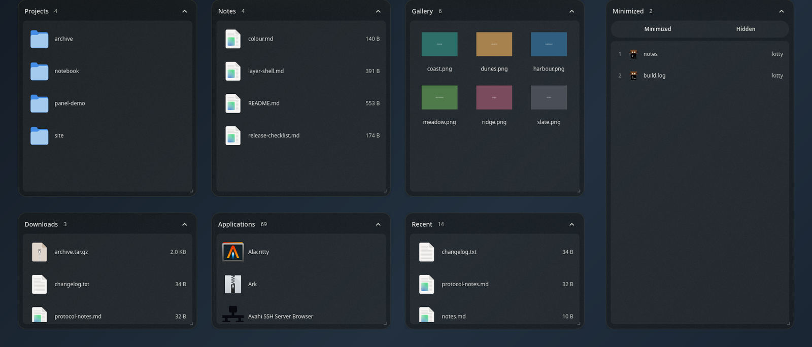
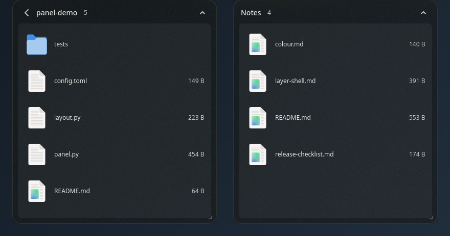
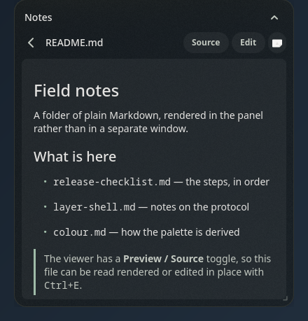
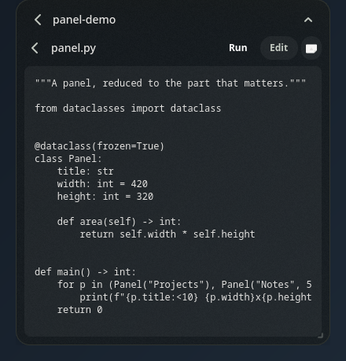
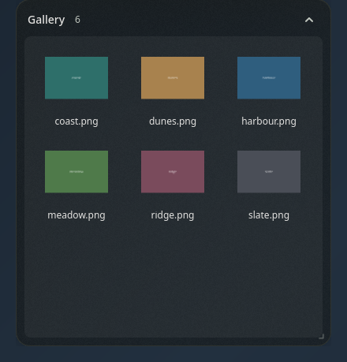
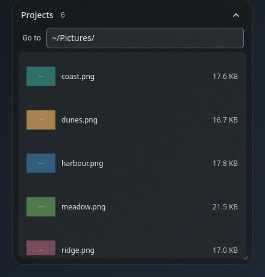
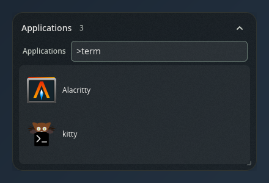
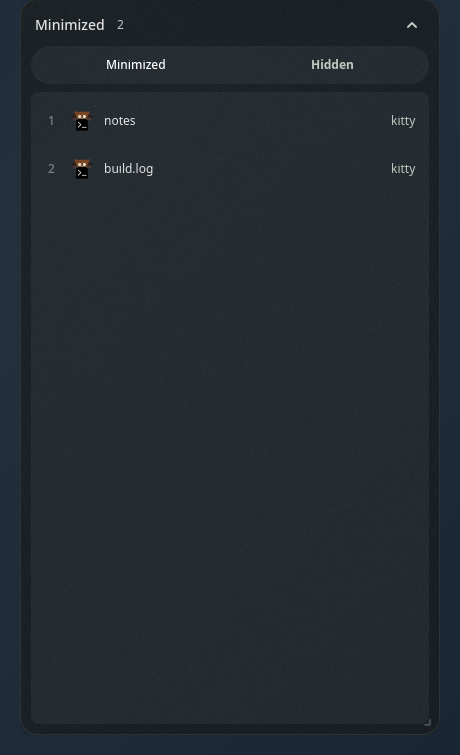
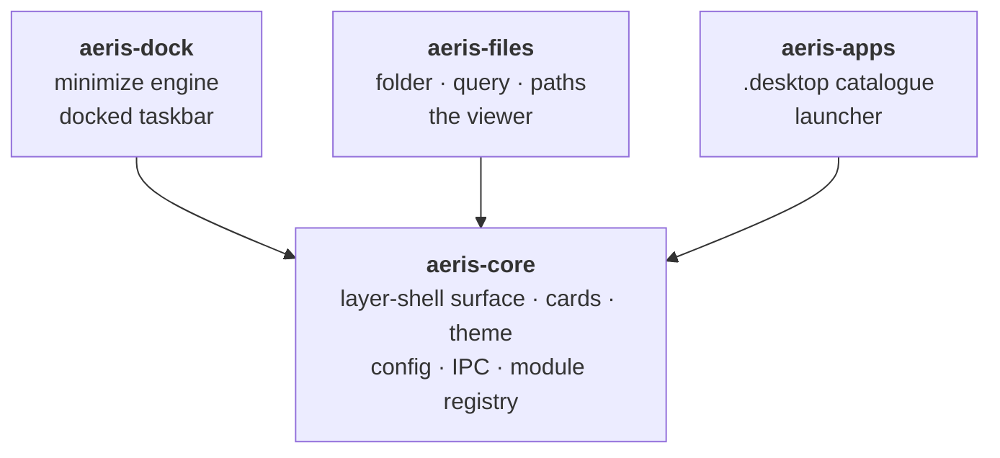

<div align="center">


# AERIS

**Desktop fences for Wayland.**

Panels that live on your desktop, hold folders and saved searches, and render
what is in them — without opening a window.

[Install](#install) · [Usage](docs/usage.md) · [Configuration](docs/configuration.md) · [Architecture](docs/architecture.md) · [Troubleshooting](docs/troubleshooting.md)

</div>



---

## What this is

A desktop organiser for Wayland compositors that implement
`wlr-layer-shell`. Each panel is a layer surface anchored to the desktop —
not a window you alt-tab to, not an icon grid the file manager paints. It
sits where you put it, below your windows, and stays there.

A panel can hold a folder, a saved search across several folders, or a fixed
list of paths. Activating a row opens the file **in the panel**: Markdown
rendered, code monospaced, images scaled, video played. You can edit and
save there, and run a file with its output streaming into a pane below it.

**The problem it solves.** [PecoFence](https://github.com/DayuanJiang/PecoFence)
and Stardock Fences are the good tools in this category and both are
Windows-only — PecoFence is ~105k lines of Rust written directly against
Win32, Direct2D, DirectComposition and WebView2. There is no port, and on
Wayland the category was simply empty. Opening a file manager window to
check one file is a poor trade when the panel is already on screen.

**Who it is for.** People on a tiling Wayland compositor who want their
desktop to hold things, and who would rather configure it in a file than
drag it into place. It is driven by a config file, a keyboard, and a control
socket — in that order.

**What makes it different.** Three things, none of them cosmetic:

- **The panel renders the file.** Most organisers are a shortcut grid that
  hands the file to another application. This one shows it.
- **Four packages, installable in any subset.** Core draws panels and has no
  opinion about content. Install only the file module and you have no
  taskbar, no application launcher, and no dead code for either.
- **A control socket, not just a GUI.** Every action the UI performs is a
  verb on a Unix socket that returns JSON, so a keybind, a script or an
  agent can drive it. `aeris describe` is the catalogue.

---

## Features

### Panels that hold a real view of the filesystem

Nothing is sandboxed or copied. A rename, a delete or a save in a panel is
the same operation every other application sees, immediately. Walk into a
subfolder and the panel follows; the header names where you are.



### Files rendered in place

Markdown with a **Preview / Source** toggle, code with the language named,
images scaled to the panel, video and audio played by GTK's own media stack,
PDF first pages where poppler is installed. Anything with no renderer still
opens and describes itself rather than being handed silently to whatever
claims the extension.

<table>
<tr>
<td width="50%"></td>
<td width="50%"></td>
</tr>
</table>

Editing is in place: <kbd>Ctrl</kbd>+<kbd>E</kbd>, then
<kbd>Ctrl</kbd>+<kbd>S</kbd>. Saves are atomic, preserve the file's mode,
follow symlinks rather than replacing them, and refuse if something else
wrote the file while it was open. A file too large to load whole is read-only
with a banner saying so.

### Saved searches, not buckets

A `query` source is a live filtered walk across several roots — by extension,
category, age, size or name. Nothing is moved to make the panel exist.

### Thumbnails from the desktop's own cache

AERIS reads what GIO has already generated under `~/.cache/thumbnails` and
never generates one itself: a panel that spawned thumbnailers over a folder
of RAW files would stall the compositor it is drawn on. A file whose
thumbnail has not been made yet shows its content-type icon, and gets the
picture once your file manager has been through that folder.



### One field, several modes

Type in any panel. A plain word filters what is on screen; `~/Projects`
turns the panel into a listing of that folder anywhere on disk; `>` is an
application launcher; `@` searches minimized windows. The field will not
flicker between modes — a challenger has to win twice in a row before the
panel changes shape.

<table>
<tr>
<td width="33%"></td>
<td width="33%"></td>
<td width="33%"></td>
</tr>
</table>

### A real minimize for Hyprland

Hyprland has no minimize and ignores `xdg_toplevel.set_minimized` outright.
`aeris-dock` builds one out of what the compositor does offer: the window is
parked on a special workspace with its origin workspace, fullscreen mode and
pinned state recorded in compositor window tags. Tags survive `hyprctl
reload`, which is why the taskbar and the keybind stay in step with no shared
file between them.

---

## Architecture



| Package | What it is |
| --- | --- |
| [`aeris-core`](packages/aeris-core) | The panel: layer-shell surface, cards, theme, config, CLI, IPC, module registry. Draws nothing on its own. |
| [`aeris-files`](packages/aeris-files) | Folders, saved searches, and the in-panel renderer. |
| [`aeris-dock`](packages/aeris-dock) | A real minimize for Hyprland, plus the docked taskbar. |
| [`aeris-apps`](packages/aeris-apps) | Installed applications, searchable and launchable. |

The three modules depend on core and on **nothing else** — not on each
other. Core depends on none of them: it finds them through Python entry
points, so installation *is* registration. That rule is what makes any
subset installable, and it is the one thing to check before adding an
import. [Full architecture →](docs/architecture.md)

---

## Requirements

| | |
| --- | --- |
| Compositor | Any implementing `wlr-layer-shell`: Hyprland, sway, river, niri, wayfire, KDE Plasma |
| | **`aeris-dock` additionally needs Hyprland with a Lua config** — window tags have no portable equivalent |
| Toolkit | GTK 4 ≥ 4.12, PyGObject, `gtk4-layer-shell` ≥ 1.1.1 |
| Python | ≥ 3.11 (`tomllib`) |
| Optional | GtkSourceView 5 for syntax highlighting; poppler for PDF pages |

Developed and exercised on Hyprland. The other compositors follow from the
protocol rather than from testing, and that distinction is deliberate — see
[known limitations](#known-limitations).

---

## Install

```bash
curl -fsSL https://raw.githubusercontent.com/TheManishCode/AERIS/main/packages/aeris-files/install.sh | bash
```

That installs the file module and fetches core for you. Each package has its
own installer and any one of them is a complete install:

```bash
# the panel alone — every panel will be empty without a module
curl -fsSL https://raw.githubusercontent.com/TheManishCode/AERIS/main/packages/aeris-core/install.sh | bash
# minimized applications, with a real minimize for Hyprland
curl -fsSL https://raw.githubusercontent.com/TheManishCode/AERIS/main/packages/aeris-dock/install.sh | bash
# installed applications, searchable and launchable
curl -fsSL https://raw.githubusercontent.com/TheManishCode/AERIS/main/packages/aeris-apps/install.sh | bash
```

Prefer to read it first, or to install from source:

```bash
git clone https://github.com/TheManishCode/AERIS
cd AERIS
packages/aeris-core/install.sh
packages/aeris-files/install.sh
```

Then:

```bash
aeris run
aeris new ~/Projects
```

[Full installation guide →](docs/installation.md) — dependencies per
distribution, building `gtk4-layer-shell` without root, autostart, and
uninstalling.

**Upgrading from Palisade?** Your config and state are carried across
automatically on the first `aeris` command. See
[migrating](docs/configuration.md#migrating-from-palisade).

---

## Build from source

There is nothing to compile. The packages are pure Python; GTK and
`gtk4-layer-shell` are system libraries.

```bash
git clone https://github.com/TheManishCode/AERIS
cd AERIS
packages/aeris-core/bin/aeris run     # runs from the checkout, all modules
packages/aeris-core/bin/aeris doctor  # what it loaded
```

The launcher puts every sibling `packages/aeris-*/src` on `PYTHONPATH` and
names them in `AERIS_MODULES`, because a checkout has no `.dist-info` and
entry-point discovery would find nothing.

To build wheels (hatchling, via [`build`](https://pypi.org/project/build/)):

```bash
python3 -m pip install build
for p in packages/aeris-*; do python3 -m build --wheel "$p"; done
```

---

## Configuration

One TOML file, `~/.config/aeris/aeris.toml`. AERIS reads it and never
rewrites it, so your comments and layout survive. Save it and everything
reloads live.

```toml
[settings]
layer = "bottom"        # background | bottom | top | overlay
blur = true
corner_radius = 18

# A fence is always on screen.
[[fence]]
id = "notes"
title = "Notes"
x = 48
y = 72
view = "list"
source = { type = "directory", path = "~/Notes" }

# A group is a catalogue entry — `aeris new reading` opens it as a tab.
[[group]]
id = "reading"
title = "Reading"
[group.source]
type = "query"
roots = ["~/Documents", "~/Downloads"]
ext = ["pdf", "epub"]
depth = 3
```

```bash
aeris init    # write a starter config
aeris check   # validate it and preview every panel, without a GUI
```

[Every setting, source kind and filter →](docs/configuration.md)

---

## Usage

```
~/Pro<Tab>   →  the panel is now showing ~/Projects/
>term        →  Alacritty, kitty, Konsole
@firefox     →  that window, back out of the minimize drawer
```

| | |
| --- | --- |
| Type anything | Opens the field with that character |
| <kbd>Enter</kbd> | Open a file, walk into a folder, launch an app, restore a window |
| <kbd>Esc</kbd> | Unwinds one step: close the field → back out a folder → dismiss |
| <kbd>Ctrl</kbd>+<kbd>E</kbd> / <kbd>Ctrl</kbd>+<kbd>S</kbd> | Edit / save |
| <kbd>Ctrl</kbd>+<kbd>R</kbd> | Run the file, output below it |
| <kbd>F2</kbd> / <kbd>Delete</kbd> | Rename in place / move to trash |

Everything the UI does is also a verb on the control socket:

```bash
aeris new ~/Projects
aeris collect ~/a.pdf ~/b.pdf    # a tab holding exactly those
aeris peek 5                     # raise every panel above your windows
aeris describe                   # the full catalogue, as JSON
```

[Every key, mode and command →](docs/usage.md)

---

## Project structure

```
packages/
  aeris-core/          the panel — layer shell, theme, config, IPC, registry
    bin/aeris          the launcher; sets LD_PRELOAD before python starts
    src/aeris/         app · config · ipc · registry · theme · migrate · ui/
  aeris-files/         folder, query and paths sources; the viewer
  aeris-dock/          minimize engine (Lua) and the windows source
  aeris-apps/          .desktop catalogue and the launcher mode
docs/                  installation · configuration · usage · architecture
  assets/              the mark, and the screenshots above
tools/                 installer generation, screenshots, compositor checks
```

Each package carries its own `tests/`, run from its own directory.

---

## Development

```bash
cd packages/aeris-core && python3 -m pytest tests -q
```

With no display, `xvfb-run -a python3 -m pytest tests -q`. **Both** runs are
checked in CI, including the one with no display at all — constructing a GTK
widget without a display does not raise, it segfaults, and takes every result
collected so far with it.

[Contributing →](CONTRIBUTING.md) · [Security →](SECURITY.md) · [Design decisions →](docs/decisions.md)

---

## Roadmap

Planned, not built. Nothing here is implemented today.

- **Clickable breadcrumb segments.** The header names the last two levels;
  getting *back* to an intermediate one is still <kbd>Esc</kbd>, one level
  at a time.
- **A decision on window pinning for `aeris-apps`.** Designed, never built;
  the open question is whether to build it or drop it.
- **Summing docked strips on one edge.** Two panels docked to the same edge
  stack outward and the reflow under-estimates the occupied width.
- **Verbs that cannot shadow a core built-in.** A module providing `reload`
  or `close` would silently replace core's; collisions between modules are
  reported, a collision with core is not detected.

These and the rest are in [TODO.md](TODO.md), with the file and line.

---

## Known limitations

Stated so nobody infers more than was done.

- **Tested on Hyprland.** Layer shell is a standard and the other
  compositors should work; that is a reading of the protocol, not a test
  result.
- **`aeris-dock` is Hyprland-only** and needs a Lua config. The minimize
  engine is built on Hyprland window tags.
- **One monitor.** Placement reads monitor 0; multi-monitor is untested.
- **The GtkSourceView path has never executed here.** `gtksourceview5` is
  not installed on the development machine and `gtksourceview4` cannot stand
  in (it links GTK 3). Those four tests report skips rather than passing
  silently. CI does install it.
- **No external security review.** [SECURITY.md](SECURITY.md) records an
  audit of the execution, write and IPC paths, six fixes, and — explicitly —
  what was *not* checked.
- **Not on PyPI.** Nothing of these names is published, so
  `pip install aeris-core` would fetch a stranger's package. Use the
  installers.

---

## License

MIT. See [LICENSE](LICENSE).

The omnibox's mode-stabilising idea is adapted from
shapeshift (MIT); the IPC surface
is modelled on [PecoFence](https://github.com/DayuanJiang/PecoFence)'s CLI.
Neither project's code is vendored here.
