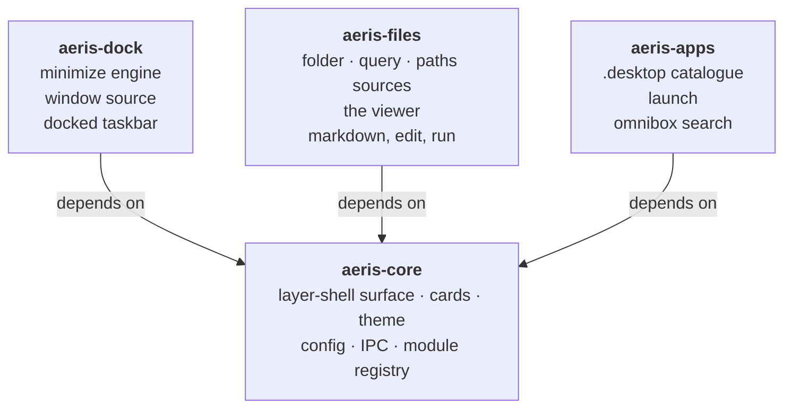

# Architecture

AERIS ships as **four** Python distributions: one shared core and three
feature modules. Three of them are the things you install on purpose; the
fourth is the thing they all stand on.



There is no edge between the three modules, and that is the whole point.
Core draws the panel and is invisible on its own; each module contributes
content to it and knows nothing about the others.

## Why a core at all

Two requirements pull in opposite directions:

* **No duplicated code when all three are installed.** Each module draws the
  same panel: the same layer-shell surface, the same header, the same raised
  card, the same rows, the same theme read from the same Material You palette.
  Three copies of that is three places to fix one bug.
* **Any one module works alone.** Installing the file manager must not drag in
  a taskbar you did not ask for.

A module that imports another satisfies the first and breaks the second.
Vendored copies satisfy the second and break the first. A shared core is the
only arrangement that satisfies both, so `aeris-core` exists and is a
dependency of each module and of nothing else. The three modules never import
one another.

## The contract

Core never imports a module. It discovers them through Python entry points,
which means installation *is* registration — there is no plugin directory to
copy files into and no config to edit.

```toml
# in each module's pyproject.toml
[project.entry-points."aeris.modules"]
files = "aeris_files:MODULE"
```

A module is one `Module` object. Every field is optional; a module declares
the subset it needs and core asks for the rest and gets nothing.

| Field | What it adds | Example |
| --- | --- | --- |
| `sources` | `kind` strings a `[group]` may use | `files` adds `folder`, `query`, `paths`, `directory` |
| `open_file` | `(path, on_close, notify) -> widget \| None` | `files` returns the viewer; `None` means "not mine" |
| `activate` | `(fence, item) -> bool` — claim a row | `dock` claims a window row and restores it |
| `status` | `() -> str \| None` — explain an empty panel | `dock` says the minimize engine is not loaded |
| `omnibox` | modes the field can turn into | `files` adds `~/…` navigation; `apps` adds the `>` launcher |
| `commands` | IPC verbs, and therefore CLI verbs | `dock` adds `minimize`, `restore`, `minimized` |
| `actions` | menu entries and their handlers | `files` adds New file/New folder; `dock` adds Restore |

`open_file` is one callable rather than a content-kind table because deciding
*what* a file is belongs to whoever can render it. A table would have forced
core to classify first, and core has no opinion about file types — that is the
module's whole job. Openers are tried in module-id order and the first to
return a widget wins; when none does, core hands the file to the desktop.

`activate` works the same way, and is why core does not know what "restore a
window" or "launch an application" means. A module that declines returns
`False` and the next gets its turn; core's own file handling is the fallback.

`commands` reaches the CLI without core knowing the verb exists. Core's
argparse table lists only its own subcommands, so anything else — `aeris
minimize 0x55a1` — is forwarded to the daemon, which has the registry and
either answers it or reports it unknown, listing everything it does answer.
Positional arguments arrive as `req["args"]`, a list of strings, because core
cannot know what a module's arguments mean and must not have to. A verb
receives the *controller*, not a fence: there is no fence involved in
minimizing a window that may not be on any panel.

A module verb is looked up **before** core's table, so one named `reload`
would silently replace core's. Nothing prevents that yet; see TODO.md.

Collisions in the keyed tables are resolved first-wins and reported, not
silently shadowed — two packages claiming one source kind is a packaging bug
and should be visible the first time it happens.

Core resolves a `[group]` by asking the registry which module owns its `kind`.
If none does, the error names the package to install. Core deliberately does
**not** whitelist source kinds in config validation either: a whitelist would
have to be edited in core every time a module is written, which is exactly the
coupling the registry exists to remove.

### The omnibox

One field per panel that changes what it is as you type. The idea and the
anti-flicker state machine are from shapeshift (MIT); the classification is
deterministic rather than a model, for the reasons in [decisions.md](decisions.md) §7.

`aeris/omnibox.py` is the decision layer and imports no GTK, so all of it
is tested without a display. Three pieces:

- **`classify(query, modes)`** ranks the installed modes. A leading sigil
  short-circuits scoring outright — you typed the mode's name, so there is
  nothing left to infer — and a sigil mode never competes on score, because
  `>` sometimes being necessary and sometimes not is worse than always
  needing it. Ties break on mode id, so which module pip wrote first does not
  decide what the field does.
- **`Stabiliser`** decides *when* to morph, which is a different question
  from *what to*. A challenger must beat the sitting mode by `MARGIN` for
  `ROUNDS` keystrokes in a row; losing once resets its streak. Without it the
  panel restrobes on nearly every character of a query that is unambiguous by
  the time you finish typing it — `~` looks like nothing, `~/` like a path,
  `~/D` more so. There is a test that types a hostile string one character at
  a time and counts how many times the panel changed shape.
- **`Mode`** is what a module contributes: `score(query)` decides whether the
  query is its business, `run(fence, query)` produces the rows. The same
  decides/computes split shapeshift makes between its model and its parsers,
  and neither half knows about the other's job. `complete(fence, query)` is
  optional and backs Tab; `complete_from` in core is the one implementation
  all four modes defer to, so Tab means the same thing in every mode.

A `Registry` is built per panel, not shared: two open fields are two separate
pieces of typing and must not share a streak.

Core ships exactly one mode, `filter`, because narrowing a list by name needs
nothing but `Item.name` — core's own type. Everything else comes from the
feature packages, so a dock-only install has `filter` and `@`, and nothing it
cannot do.

### What a module may touch on a fence

A module's verbs receive the `FenceWindow` they were invoked on, and are
limited to its public surface: `selected_items()`, `folder_root()`,
`rename_path()`, `notify()`, `refresh()`, `schedule_refresh()`,
`dismiss_if_summoned()`, `restore_at()`, `rows()`, `navigate_to()`,
`open_omnibox()`, and the `fence` config object.

`rows()` is the one an omnibox mode usually wants: it is what the source
produced, *before* the field narrowed it. A filter reading the view instead
would be filtering its own previous output, so deleting a character could
never widen the results again.

Everything else is private and may be renamed without breaking a package core
does not import.

Core registers a module's verbs on *every* fence — it cannot ask "does this
apply to a taskbar?" without learning what a taskbar is — so each verb guards
itself. `restore` on a fence full of files does nothing, by test.

### Running from a checkout

A clone has no `.dist-info`, so entry-point discovery finds nothing. The
`AERIS_MODULES` environment variable names `package:attr` specs to load in
addition to whatever is installed, and an installed module does not shadow one
named there. `bin/aeris` sets it from the sibling package directories, so
the monorepo and an installed system both work with no extra step.

## What each module owns

### aeris-core

The layer-shell window and everything that is true of every panel: geometry
and docking, the exclusive-zone reflow, layers and hiding, the theme bridge to the
desktop's Material You palette and the radius ladder derived from it
([decisions.md](decisions.md) §8), the omnibox decision layer, `aeris.toml` and `state.json`, the
daemon, the Unix-socket IPC, the group picker, and the registry above.

Installing only core gives you a working `aeris` command and an empty
desktop. That is correct: core has no opinion about what a panel should show.

### aeris-dock — minimized applications

The Hyprland minimize engine (`custom/minimize.lua` and the window tags it
writes), the `windows` source kind, the docked taskbar with its
Minimized/Hidden switch, and the restore verbs.

Hyprland-specific by nature. It degrades to "engine not loaded" on other
compositors rather than pretending.

### aeris-files — grouping folders and rendering files

Folder, query and collection source kinds; the in-panel viewer; the Markdown
parser; content classification; file creation; and runner detection for source
files. The file-manager integration (KIO service menus) ships here too.

### aeris-apps — installed applications

A catalogue of installed `.desktop` entries you can group and launch like any
other panel content.

**What this module cannot do, stated plainly:** it cannot draw another
application *inside* an AERIS panel. Wayland has no XEmbed — a client cannot
host another client's surface, and only the compositor composites windows.
Anything claiming otherwise on Wayland is either an Electron webview or a
compositor plugin.

What it does is scan `.desktop` entries, offer them as rows and in the
omnibox, and launch them. That is the whole of it today.

There is an idea for going further — ask Hyprland to float a window and park
it over a panel's rectangle, which would look embedded while still being a
separate toplevel and the compositor doing the work. It is **not built**, and
earlier revisions of this file described it as though it were. See TODO.md.

## Repository layout

The monorepo here is the development tree; each package directory is a
complete, publishable repository.

```
packages/
  aeris-core/   pyproject.toml  install.sh  README  LICENSE
                   bin/aeris  src/aeris/{,data/}  docs/  tests/
  aeris-dock/   pyproject.toml  install.sh  README  LICENSE
                   src/aeris_dock/{,hypr/minimize.lua}  tests/
  aeris-files/  pyproject.toml  install.sh  README  LICENSE
                   src/aeris_files/  tests/
  aeris-apps/   pyproject.toml  install.sh  README  LICENSE
                   src/aeris_apps/  tests/
```

Each directory is a complete, publishable repository: its own README, LICENSE
and installer, and a test suite that runs from its own root with no
`PYTHONPATH` incantation. Data files live *inside* the package
(`src/aeris/data/`) so one path works from a checkout and from
site-packages alike.

`tools/split-repos.sh` turns each directory into a standalone branch with
`git subtree split`, so per-package history follows it out rather than
producing four "initial commit" dumps. `tools/gen-installers.py` writes the
three module installers from one template — they become three repositories and
cannot share a script, so generating them is how they stay in step.

## Installing

One command per module. Core comes with whichever you install first, and is
never installed twice.

```bash
curl -fsSL .../aeris-files/main/install.sh | bash
```

The installer adds the system packages it needs (PyGObject and
gtk4-layer-shell are system libraries, not wheels), installs the package, does
whatever only it can do — aeris-dock places `custom/minimize.lua`,
aeris-files adds the file-manager menu entries — and restarts a running
daemon, because the module list is built once at startup and a module
installed underneath a running daemon is otherwise invisible.

`aeris doctor` reports which modules are installed, what each missing one
would add, and the command to install it.
