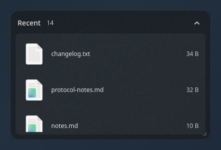

# Usage

Everything you can press, type or run. Read from the source, not from
memory: if something here disagrees with the code, the code is right and this
file is a bug.

- [Getting started](#getting-started)
- [Keys](#keys)
- [The field](#the-field)
- [Workflows](#workflows)
- [CLI](#cli)
- [Menus](#menus)
- [Compositor keybinds](#compositor-keybinds)

See [configuration.md](configuration.md) for the config file itself.

---

## Getting started

Start the daemon:

```bash
aeris run
```

Nothing appears. That is deliberate — the desktop starts empty, and a
`[[group]]` in the config is a *menu entry*, not a panel. There are two ways
to put something on screen:

```bash
aeris new downloads      # open a group as a tab, by id
aeris new ~/Projects     # or open any folder directly
aeris new                # or pick from the catalogue
```

A **tab** is opened on demand and remembers where you dragged it. A
**fence** is placed in the config with an `x` and `y` and is always there.
Both are the same kind of panel; the difference is who decided it should
exist.

```bash
aeris check      # validate the config and preview every panel, no GUI
aeris doctor     # which modules are installed
```


---

## Keys

### In a panel

| Key | Does |
| --- | --- |
| Type any character | Opens the field, holding that character |
| <kbd>Ctrl</kbd>+<kbd>F</kbd> | Opens the field empty |
| <kbd>Enter</kbd> / double-click | Open a file, walk into a folder, launch an app, restore a window |
| <kbd>Backspace</kbd> or <kbd>Alt</kbd>+<kbd>←</kbd> | Back up one folder |
| <kbd>Alt</kbd>+<kbd>Home</kbd> | Back to the panel's own folder, however deep you walked |
| <kbd>Esc</kbd> | Close the field → back out one folder → dismiss the panel. One step per press |
| <kbd>F2</kbd> | Rename in place |
| <kbd>Delete</kbd> | Move to trash |
| <kbd>F5</kbd> | Re-scan now |
| <kbd>Ctrl</kbd>+<kbd>C</kbd> | Copy the selected paths |
| <kbd>Ctrl</kbd>+<kbd>A</kbd> | Select all |
| <kbd>Ctrl</kbd>+<kbd>N</kbd> | New file *(needs aeris-files)* |
| <kbd>Ctrl</kbd>+<kbd>Shift</kbd>+<kbd>N</kbd> | New folder *(needs aeris-files)* |
| Right-click a row | Item menu |
| Right-click the header | Panel menu |
| Double-click the header | Collapse / expand |
| Drag the header or empty space | Move the panel |
| Drag the bottom-right grip | Resize |

### In the field

| Key | Does |
| --- | --- |
| <kbd>Tab</kbd> | Complete. Then, with nothing left to add, move into the list |
| <kbd>Enter</kbd> | Open the first row |
| <kbd>Up</kbd> | What you typed before, newest first |
| <kbd>Down</kbd> | Forward through history while recalling; otherwise into the list |
| <kbd>Esc</kbd> | Close the field, panel unchanged |

<kbd>Tab</kbd> follows the shell's rule: extend to the longest prefix every
match shares and stop there, never guessing which one you meant. A single
folder match gets its trailing `/`, so Tab/Tab/Tab walks a tree without typing
a separator or a capital. With nothing left for the mode to add, Tab falls
back to history — the newest thing you typed that starts the same way.

<kbd>Up</kbd> walks what you have typed before, filtered by whatever is
already in the field, so typing `~/P` and pressing Up offers only the paths
starting that way. Entries are kept per mode and carry their sigil, so
recalling a `>launcher` entry puts you back in the launcher. Fifty per mode,
in `$XDG_STATE_HOME/aeris/history.json`; delete the file to forget
everything. Only queries you actually accepted are recorded, not every prefix
typed on the way there.

### In a file viewer *(aeris-files)*

| Key | Does |
| --- | --- |
| <kbd>Esc</kbd> | Unwinds one layer: stop editing, then dismiss run output, then back to the list where you left it |
| <kbd>Ctrl</kbd>+<kbd>E</kbd> | Edit what can be edited, otherwise toggle Markdown preview |
| <kbd>Ctrl</kbd>+<kbd>S</kbd> | Save — only while editing |
| <kbd>Ctrl</kbd>+<kbd>R</kbd> | Run the file, output in a pane below it |
| <kbd>Ctrl</kbd>+<kbd>Z</kbd> | Undo. Survives leaving and re-entering edit mode |
| <kbd>Ctrl</kbd>+<kbd>O</kbd> | Open in the desktop's default application |

<kbd>Ctrl</kbd>+<kbd>E</kbd> is one key read in context: the two never both
apply, because editing a Markdown file *is* its source view. <kbd>Esc</kbd>
unwinds editing before it leaves the file, so a reflex press does not discard
a dirty buffer — and dismisses the run output before it leaves the file, since
closing the file to be rid of a pane that is a third of it is a bigger step
than was asked for.

### In the taskbar *(aeris-dock)*

| Key | Does |
| --- | --- |
| <kbd>1</kbd>–<kbd>9</kbd> | Restore that row outright |
| <kbd>Enter</kbd> / <kbd>Space</kbd> | Restore the selection |
| <kbd>Tab</kbd> | Switch between Minimized and Hidden |
| <kbd>Esc</kbd> | Dismiss |

Destructive keys are deliberately off here: <kbd>Delete</kbd> does nothing, and
closing a window is menu-only.

### In the group picker

| Key | Does |
| --- | --- |
| Type | Filter the list |
| <kbd>Alt</kbd>+<kbd>1</kbd>–<kbd>9</kbd> | Jump straight to that row |
| <kbd>↑</kbd> / <kbd>↓</kbd> then <kbd>Enter</kbd> | Pick |
| <kbd>Esc</kbd> | Dismiss |

The modifier on the digits is not decoration: a bare digit is legitimate filter
text (a group may well be called "2024-archive"), and the search entry consumes
it before the shortcut could see it.

---
---

## The field

One input per panel that changes what it is as you type. What it can turn into
depends on which packages are installed.

| You type | It becomes | From |
| --- | --- | --- |
| `report` | A filter over the rows already on screen | core |
| `~/Documents`, `/etc`, `./src`, `sub/thing` | A listing of that folder, anywhere on disk | aeris-files |
| `>firefox`, `>browser` | An application launcher | aeris-apps |
| `@kitty` | A search over minimized windows | aeris-dock |

**Sigils are the only way into `>` and `@`.** An application name is an
ordinary word — "code", "files" and "notes" are all programs *and* all
plausible filter queries — so a launcher that competed on score would steal the
field exactly when you wanted it.

**It will not flicker.** A mode must beat the one showing by 0.15 for two
keystrokes running before the panel changes shape. Only a sigil skips the wait.

**Path details.** A trailing `/` lists the folder whole; without one the last
segment filters it. A leading dot is a mode switch — `~/.c` lists *only* hidden
entries, anything else lists only visible ones. <kbd>Enter</kbd> navigates the
panel there without touching its saved source; <kbd>Alt</kbd>+<kbd>Home</kbd>
comes back.

**Launcher details.** Name matches rank first, then matches on an entry's
comment or category — which is why `>term` finds Alacritty, kitty and Konsole,
none of which have "term" in their name.

---


---

## Workflows

### Read a file without opening an editor

Activate a row. The panel swaps the list for the file and keeps the list's
scroll position and selection; <kbd>Esc</kbd> swaps it back. Markdown is
rendered with a **Preview / Source** toggle, code is monospaced with the
language named, images are scaled to the panel, and anything with no
renderer gets a description card rather than being silently handed to
whatever claims the extension.


### Edit and save in place

<kbd>Ctrl</kbd>+<kbd>E</kbd> to edit, <kbd>Ctrl</kbd>+<kbd>S</kbd> to save.
The title carries a dot while there are unsaved changes, and <kbd>Esc</kbd>
asks once before discarding them — a layer-shell panel cannot host a "save
changes?" dialog, so the confirmation is pressing the key again.

Saving is atomic, preserves the file's permissions, follows symlinks rather
than replacing them, and refuses if something else wrote the file after you
opened it. A file too large to load whole is read-only, with a banner saying
so.

### Run a file and watch its output

<kbd>Ctrl</kbd>+<kbd>R</kbd> with a code or Markdown file open, when a
toolchain for its language is on `PATH`. The file is saved first, then the
output streams into a pane below it — a third of the panel, following its own
newest line while you keep your place in the source. <kbd>Esc</kbd> dismisses
the pane. AERIS detects what you have; it never installs a compiler.


### Keep a live view instead of a folder

A `query` source is a saved search: filtered, depth-limited, across several
roots. Nothing is moved or copied to make the panel exist.



### Pick a specific window back out of the taskbar

*(aeris-dock)* Hyprland has no minimize, so the module supplies one: a
minimized window is parked on a special workspace with its origin recorded in
compositor window tags. The taskbar reads those tags, so it stays in step with
the keybind path without a shared file to go stale.


### Launch an application

*(aeris-apps)* Type `>` in any panel's field. Name matches rank first, then
matches on an entry's comment or category — which is why `>term` finds
Alacritty, kitty and Konsole, none of which have "term" in their name.


### Group a selection from the file manager

*(aeris-files)* "Group in AERIS" and "Open as an AERIS tab" appear in
Dolphin, Nautilus and anything else that reads `.desktop` actions. Add them
with `aeris install-menus`.

---

## CLI

`!` mutates.

| | Command | Returns |
| --- | --- | --- |
| | `aeris run` | Start the daemon |
| | `aeris init` | Write a starter config |
| | `aeris check` | Validate the config, preview every panel |
| | `aeris doctor` | Which modules are installed, which are missing |
| | `aeris install-launcher` | Symlink `~/.local/bin/aeris` at this checkout |
| | `aeris hyprland-rule` | Print compositor rules for permanent blur |
| | `aeris install-menus` | Add AERIS to the file manager's right-click menu |
| | `aeris ping` | Is the daemon up |
| | `aeris describe` | Machine-readable command catalog |
| | `aeris config-path` | Path of the active config |
| | `aeris list` | Every panel with its live item count |
| | `aeris show <id>` | One panel, including item names |
| | `aeris theme` | Active Material 3 tokens and where they came from |
| | `aeris groups` | The catalogue of groups |
| | `aeris tabs` | Tabs currently open |
| | `aeris hidden` | Panels currently hidden |
| ! | `aeris reload` | Re-read config and theme, rebuild |
| ! | `aeris refresh` | Re-scan sources without rebuilding |
| ! | `aeris new [group]` | Open a tab. No argument opens the picker |
| ! | `aeris toggle <group>` | Open it, or close it if already open |
| ! | `aeris close <id\|all>` | Close a tab |
| ! | `aeris collect <paths…>` | A new tab holding exactly those paths |
| ! | `aeris move <id> <x> <y>` | |
| ! | `aeris resize <id> <w> <h>` | |
| ! | `aeris layer <id> <layer>` | |
| ! | `aeris collapse <id> <bool>` | |
| ! | `aeris lock <id> <bool>` | |
| ! | `aeris hide <id> <bool>` | |
| ! | `aeris unhide <id>` | Bring a hidden panel back |
| ! | `aeris peek <seconds>` | Raise every panel above your windows, briefly |

### From modules

These exist only when the package providing them is installed. `aeris
describe` lists what the running daemon actually answers, each tagged with the
module it came from; a verb core does not recognise is forwarded to the daemon
rather than rejected, which is how they reach the CLI at all.

| | Command | Package | Returns |
| --- | --- | --- | --- |
| | `aeris minimized` | aeris-dock | Every minimized window, with its address |
| ! | `aeris minimize [address]` | aeris-dock | Park a window. With no address, the focused one |
| ! | `aeris restore [address\|last\|all]` | aeris-dock | Put one back where it came from. Defaults to `last` |
| ! | `aeris restore-all` | aeris-dock | Put every minimized window back |
| ! | `aeris close-window <address>` | aeris-dock | Close a window. Discards unsaved work |

`minimize` with no argument takes the focused window, and `restore` with none
means the one you minimized most recently — the two cases that would otherwise
force you to look up a hex address to undo something you just did. `last` and
`all` are the only two words either verb accepts; everything else is treated
as an address.

An address is `0x` followed by up to 16 hex digits, exactly as `aeris
minimized` and `hyprctl clients -j` report it. Anything else is refused:
addresses are interpolated into Lua that the compositor executes, so this is a
security boundary rather than a tidiness check.

```bash
aeris minimized
```

### Optional libraries

Installed, they are used; absent, the feature degrades and nothing fails.

| Library | Package provides | Brings | Without it |
| --- | --- | --- | --- |
| GtkSourceView 5 | aeris-files | Highlighting, line numbers, auto-indent | Monospaced text, language named |
| poppler | aeris-files | PDF pages in the panel | File description, Open externally |

Thumbnails are read from the desktop's cache (`~/.cache/thumbnails`) and are
never generated by AERIS — a panel that spawned thumbnailers over a folder
of RAW files would stall the compositor it is drawn on. Files without a cached
thumbnail show their content-type icon.

---
---

## Menus

### Right-click a row

**Files:** Open · Open in default app · Open containing folder · Copy path ·
Rename… · Group into a new tab · Move to trash

**Windows:** Restore · Restore all · Close window

### Right-click the header

New file · New folder · Place (On the desktop / Above windows) · Lock position ·
Collapse / Expand · Hide this fence · Close tab

---
---

## Compositor keybinds

Not part of AERIS — these live in `~/.config/hypr/custom/keybinds.lua` and
are listed here because they are how you reach it.

| Key | Does |
| --- | --- |
| <kbd>Super</kbd>+<kbd>Alt</kbd>+<kbd>T</kbd> | New tab — opens the group picker |
| <kbd>Super</kbd>+<kbd>Alt</kbd>+<kbd>Shift</kbd>+<kbd>T</kbd> | Close every tab |
| <kbd>Super</kbd>+<kbd>Alt</kbd>+<kbd>Tab</kbd> | Toggle the minimized taskbar |
| <kbd>Ctrl</kbd>+<kbd>Alt</kbd>+<kbd>Space</kbd> | Peek: raise all panels above windows for 5s |
| <kbd>Super</kbd>+<kbd>S</kbd> | Minimize the focused window |
| <kbd>Ctrl</kbd>+<kbd>Super</kbd>+<kbd>N</kbd> | Restore the last minimized |
| <kbd>Ctrl</kbd>+<kbd>Super</kbd>+<kbd>Shift</kbd>+<kbd>N</kbd> | Restore all minimized |
| <kbd>Ctrl</kbd>+<kbd>Super</kbd>+<kbd>Alt</kbd>+<kbd>N</kbd> | Peek into the minimize drawer workspace |